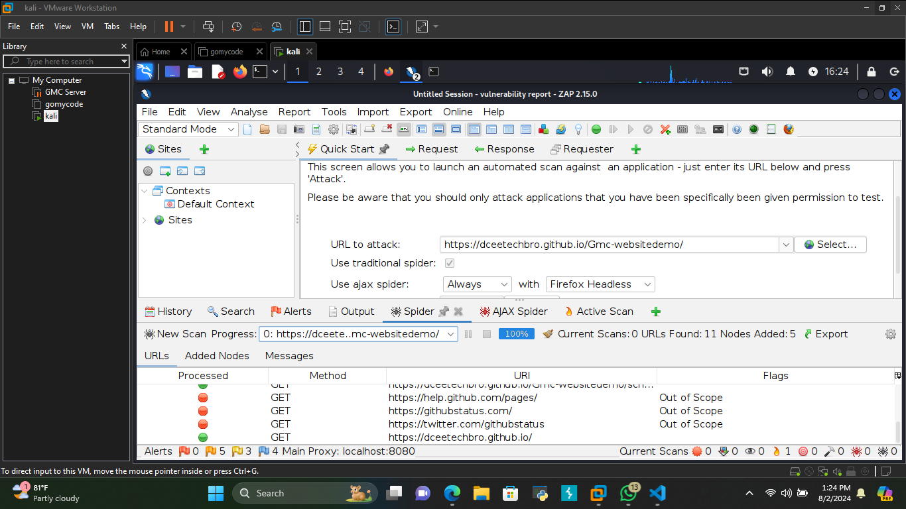
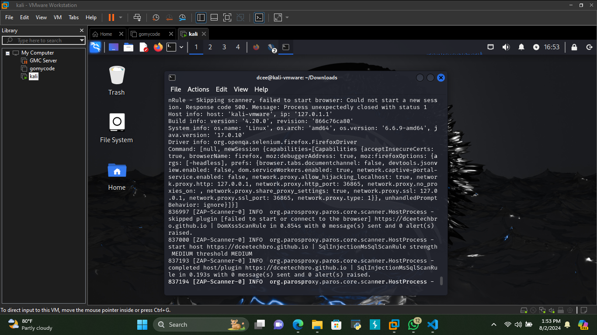
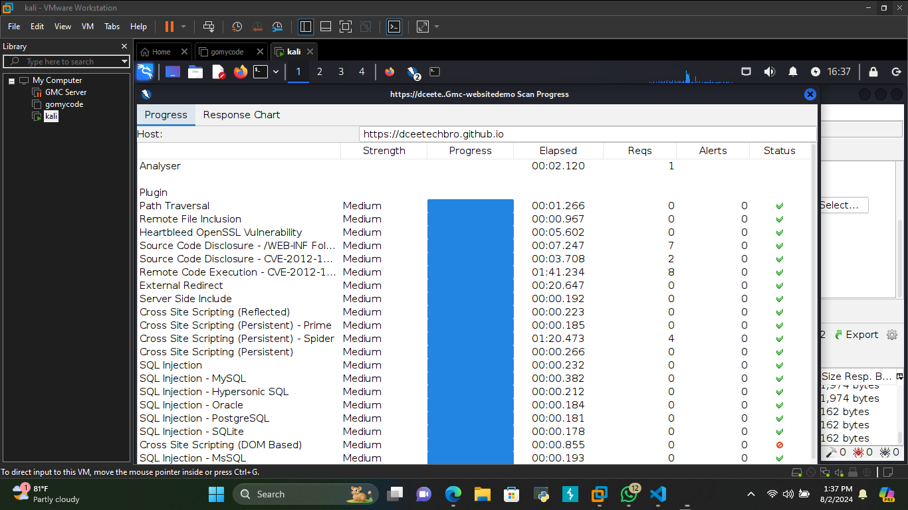

<h1>phase3-gmcproject</h1>
This repository contains the detailed vulnerability assessment report generated from a Zap attack on the web resources hosted at https://dceetechbro.github.io/Gmc-websitedemo. The assessment aims to identify potential security issues, such as broken links and improper redirections, and provides recommendations to mitigate these vulnerabilities.

<h1>Performed various security tests</h1>

a) Spider the target:
Enter the target URL (e.g., https://dceetechbro.github.io/Gmc-websitedemo/) in ZAP
Right-click the URL and select "Spider"
This will map out the structure of the site

b) Active Scan:

After spidering, right-click the target and select "Active Scan"
This will automatically test for various vulnerabilities
c) Manual testing:

Use ZAP's "Manual Explorer" to browse the site, ensuring all functionality is covered
Pay special attention to forms, login mechanisms, and areas handling sensitive data

<h1>Vulnerability Assesments and Report</h1>

<h1>Brief overview of the assessment,
Key findings and overall risk level,
High-level recommendations</h1>

<h1>Brief Overview Of The Assesment</h1>

1. <h1>Initial Request Analysis</h1>

ID: 16
Request Timestamp: Fri Aug 02 16:23:47 EDT 2024
Response Timestamp: Fri Aug 02 16:23:49 EDT 2024
Method: GET
URL: https://dceetechbro.github.io/Gmc-websitedemo/...
Response Code: 404
Reason: Not Found
Round Trip Time (RTT): 2102 ms
Response Header Size: 733 bytes
Response Body Size: 9379 bytes
Observation: The initial GET request resulted in a "404 Not Found" response, indicating that the requested resource was not available on the server.

2. <h1>Redirect Analysis</h1>

ID: 18, 19, 20, 21
Request Timestamps: Fri Aug 02 16:23:49 to Fri Aug 02 16:23:52 EDT 2024
Response Timestamps: Fri Aug 02 16:23:50 to Fri Aug 02 16:23:55 EDT 2024
Method: GET
URL: https://dceetechbro.github.io/Gmc-websitedemo
Response Code: 301
Reason: Moved Permanently
RTT: 933 ms - 2575 ms
Response Header Size: 551-554 bytes
Response Body Size: 162 bytes
Observation: Subsequent requests resulted in a "301 Moved Permanently" response, indicating that the requested resource has been permanently moved to a new URL. This type of response typically includes the new URL in the "Location" header of the response.

<h1>Key Findings and Overall Risk Level</h1>

1. <h1>404 Not Found Errors:</h1>

Several resources were found to be missing, resulting in 404 errors.
Recommendation: Verify the existence of resources and update any broken links.

2. <h1>301 Moved Permanently Responses:</h1>

Multiple requests were redirected to new URLs, indicating that the resources have been moved.
Recommendation: Update all references to the old URLs to point to the new locations to avoid unnecessary redirections.

<h1>High-level recommendations</h1>

1. <h1>404 Not Found Error:</h1>

Issue: The resource at the URL https://dceetechbro.github.io/Gmc-websitedemo/... was not found.
Impact: Users or automated systems trying to access this resource will encounter errors, which could lead to a poor user experience or broken functionality.
<h1>Recommendation: Ensure that the URL is correct and that the resource exists. If the resource has been moved, update any links or references to point to the new location.</h1>

2. <h1>301 Moved Permanently:</h1>

Issue: The resource at https://dceetechbro.github.io/Gmc-websitedemo has been permanently moved.
Impact: Users and systems will be redirected to the new location. However, if the redirection is not properly handled, it can cause delays or further errors.
<h1>Recommendation: Update all references to this URL to the new location to avoid unnecessary redirection. Ensure that the server configuration properly handles redirections and that the new URLs are functional.</h1>

This vulnerability assessment indicates issues primarily related to resource availability and proper URL redirection. Addressing these issues involves verifying resource existence, updating URLs, and ensuring proper redirection configurations. Regular monitoring and testing should be implemented to catch such issues early and maintain a seamless user experience.
